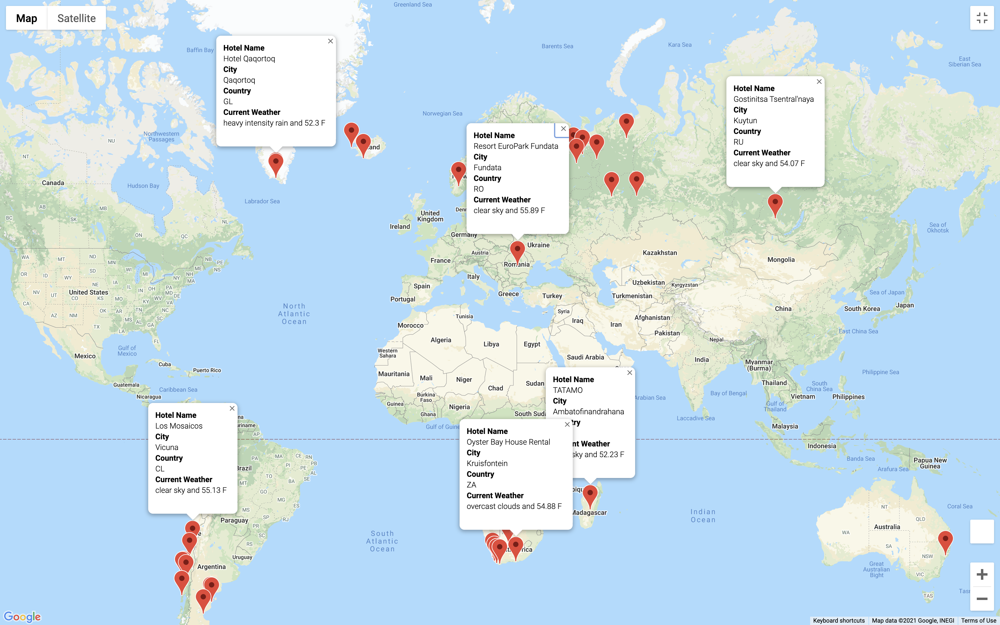

# WeatherPy
## **Overview of WeatherPy**

**Purpose:** 
The purpose of WeatherPy App is to collect weather data for cities around the world using OpenWeather Api and generate travel destinations and itineraries map using google map Api. 

**Objectives:** 
The overarching objectives and related deliverables for this analysis are the followings:

1. Retrieve Weather Data
2. Create a Customer Travel Destinations Map
3. Create a Travel Itinerary Map

**Resources:**
1. Data Source: 
- Data collected through Api calls:
    1. OpenWeather (https://openweathermap.org/api)
    2. Googlemap for places and directions (https://developers.google.com/maps)  

2. Software: 
- Python 3.6.1 (libraries: pandas, requests, gmaps) 
- Jupyter notebook

**WeatherPy outputs:**
    
1. Weather data for 784 cities around the world stored in WeatherPy_Database.csv.
2. Customer travel destinations map based on prefered tempreture between 50 to 56 fahrenheit degrees.

3. travel itinerary for selected cities in South Africa

